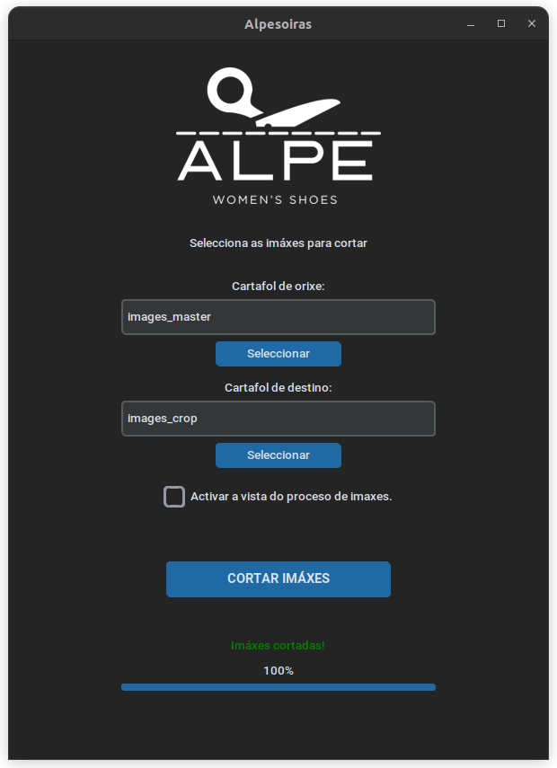
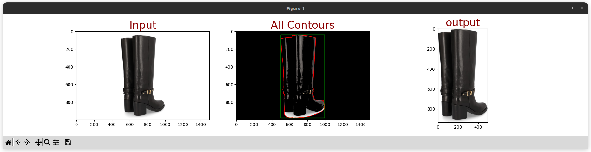

# Alpesoiras
#### Recorte automático de  imágenes para Web de calzados ALPE
***
## Instalación
Aplicación de Python3 con dependencia de [Tkinter](https://docs.python.org/es/3/library/tkinter.html) y [CustomTkinter](https://customtkinter.tomschimansky.com/) para la **GUI** y de las librerías [CV2](https://pypi.org/project/opencv-python/), [Numpy](https://numpy.org/) y [Matplotlib](https://matplotlib.org/) para el recorte de imágenes, así como de la librería [Pillow](https://python-pillow.org/) para el tratamiento de las imágenes.

```
sudo apt-get install python3-tk 
```
```
pip install customtkinter
pip install opencv-python
pip install numpy
pip install matplotlib
pip install pillow
```
## Instrucciones
* Abre una terminal y ejecuta:
```
python3 app.py
```
* Inserta la dirección de la carpeta de origen y de la carpeta de destino. Puedes usar direcciones relativas a la ubicación de la *App.py* o absolutas. 

* Pulsa el botón **Cortar Imágenes** para ejecutar la función de recorte automático.

Todas las imágenes de la carpeta de origen se copiarán recortadas a la carpeta de destino.

Una vez terminada la copia mata el proceso en la terminal pulsando
`Ctrl + Z`




## Modo vista previa

Si activas **"Activar a vista do proceso de imaxes."** por cada imágen se mostrará una ventana de *vista previa* de la imagen sin recortar, de la zona seleccionada y de la salida final.



> *Ten en cuenta que si son muchas las imágenes a recortar el proceso puede prolongarse mucho. Si deseas abortar esta vista mata el proceso en la terminal y vuelve a lanzar la cola de recorte.*

